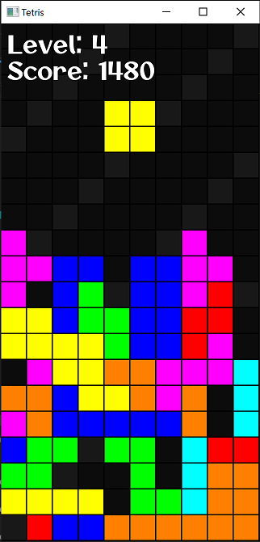

# Tetris
Tetris written in C++ using the SFML library.

# Gameplay
The standard rules of Tetris apply.

Clearing a line increases your score. How much score is added when you clear a line depends on how many lines you clear at once and your current level. To level up you need to clear 5 lines after which the blocks will start to fall faster. 

If you reach the top of the screen then it's game over. The window will make you aware that you have lost by CEASING TO EXIST (I'll make a game over screen in the future).

The rotation system used is the SRS (Super Rotation System) in which each piece has a designated centre of rotation which it rotates around. Wall kicks are a feature so rotating into a wall will "kick" your piece away from it.

# Controls
| Command |   Action   |
|:-------:|:----------:|
|    W    |   Rotate   |
|    A    |  Move Left |
|    D    | Move Right |
|    S    |  Soft Drop |

# Running (Windows only)
To run:
1. Download the contents of the bin folder
2. Run the Tetris.exe executable

If you're on a Mac, I'm sorry. You would have to download the SFML library files for Mac and then compile the source yourself using clang or an equivalent c++ compiler.

Enjoy :)
